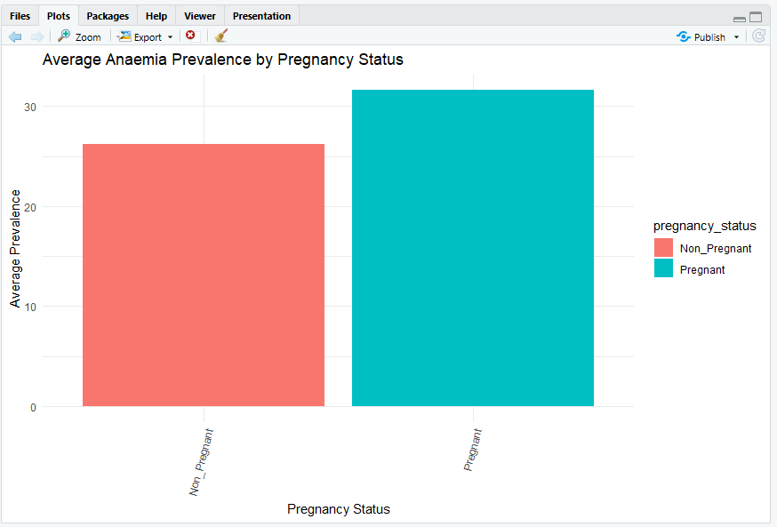

# Analysis

## Objective
1. Compare anaemia prevalence among women aged 15–49 years by pregnancy status.

2. Examine differences in anaemia prevalence across world regions.

3. Compare the mean anaemia prevalence across regions.

## Methods

- Data cleaning in R.

- Descriptive statistics.

- Data visualization.

- ANOVA and Tukey HSD tests.

## Key Findings

* Anaemia prevalence differed significantly between pregnancy status groups, with pregnant women generally exhibiting higher prevalence rates than non-pregnant women.

* Anaemia prevalence varied considerably across world regions, indicating substantial geographical differences in disease burden.

* Africa recorded some of the highest anaemia prevalence levels, while Europe generally showed lower prevalence rates.

* Mean anaemia prevalence differed across regions, suggesting that regional factors may influence the distribution of anaemia among women aged 15–49 years.

* The findings highlight the continued public health burden of anaemia, particularly in regions with consistently high prevalence rates.

#Visualisations.
## 1. Anaemia Prevalence by Pregnancy Status (Boxplot)
## Anaemia Prevalence by Pregnancy Status (Boxplot)

This boxplot compares the distribution of anaemia prevalence between pregnancy status groups. Pregnant women generally exhibit higher prevalence rates than non-pregnant women.

## 2. Mean Anaemia Prevalence by Pregnancy Status

## 3. Anaemia Prevalence Across Regions

## 4. Regional Trends in Anaemia Prevalence Over Time

The boxplot demonstrates clear differences in anaemia prevalence by pregnancy status. Pregnant women exhibited higher median anaemia prevalence and a wider distribution of values compared with non-pregnant women, indicating both a greater burden and greater variability in prevalence across countries. Several high-value outliers were observed in both groups, suggesting that some countries experience exceptionally high anaemia prevalence. These findings support the ANOVA results, which confirmed statistically significant differences in anaemia prevalence between pregnancy status groups.

ANOVA Results (Place Directly Below the Boxplot)

A one-way ANOVA revealed a statistically significant difference in anaemia prevalence across pregnancy status groups, F(2, 13,932) = 316.3, p < .001. Post-hoc Tukey tests indicated that pregnant women had significantly higher anaemia prevalence than non-pregnant women and women of reproductive age.

## Conclusion

This analysis revealed significant differences in anaemia prevalence among women aged 15–49 years by pregnancy status and region.
Pregnant women generally experienced higher prevalence rates than non-pregnant women, highlighting the increased nutritional demands associated with pregnancy. 
Anaemia prevalence also varied considerably across regions, with African regions exhibiting higher prevalence levels compared to Europe.

The regional disparities observed may reflect differences in socioeconomic development, access to healthcare, nutritional status, disease burden, and public health interventions.
Overall, the findings underscore the continued importance of targeted strategies to reduce anaemia, particularly among pregnant women and populations in high-burden regions.
