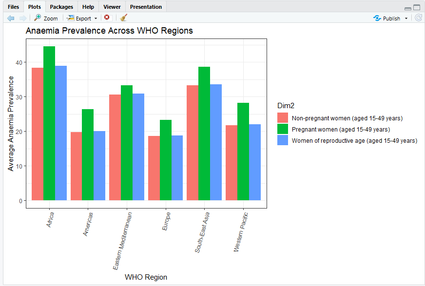
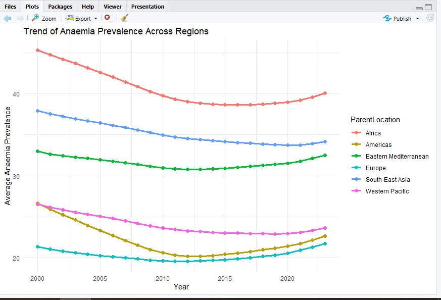
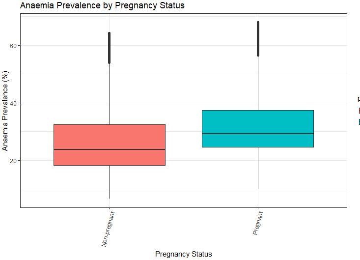

# Analysis

## Objective
1. Compare anaemia prevalence among women aged 15–49 years by pregnancy status.

2. Examine differences in anaemia prevalence across world regions.

3. Compare the mean anaemia prevalence across regions.

## Methods

- Data cleaning in R.

- Descriptive statistics.

- Data visualization.

- ANOVA and Tukey HSD tests.

#Visualisations.

## Anaemia Prevalence Across WHO Regions (Bar Chart)

### Interpretation

Anaemia prevalence varied substantially across WHO regions and pregnancy status groups. Africa consistently recorded the highest prevalence levels, with pregnant women experiencing the greatest burden (approximately 45%). South-East Asia also exhibited high prevalence levels, while Europe and the Americas reported the lowest prevalence across all groups. In every region, pregnant women had higher average anaemia prevalence than non-pregnant women, highlighting pregnancy as an important risk factor for anaemia.

## Trend of Anaemia Prevalence Across Regions (Line Chart)

### Interpretation

Anaemia prevalence generally declined across all WHO regions between 2000 and approximately 2012–2015, indicating improvements in maternal and women's health outcomes. However, after this period, progress slowed and prevalence levels stabilized or increased slightly in several regions. Africa remained the region with the highest prevalence throughout the study period, while Europe maintained the lowest prevalence. Despite overall improvements, substantial regional disparities persisted over time.

## Anaemia Prevalence by Pregnancy Status (Boxplot)

### Interpretation

The boxplot demonstrates clear differences in anaemia prevalence by pregnancy status. Pregnant women exhibited higher median anaemia prevalence and a wider distribution of values compared with non-pregnant women, indicating both a greater burden and greater variability in prevalence across countries. Several high-value outliers were observed in both groups, suggesting that some countries experience exceptionally high anaemia prevalence. These findings support the ANOVA results, which confirmed statistically significant differences in anaemia prevalence between pregnancy status groups.

### ANOVA Results

A one-way ANOVA revealed a statistically significant difference in anaemia prevalence across pregnancy status groups, *F*(2, 13,932) = 316.3, *p* < .001. Post-hoc Tukey tests indicated that pregnant women had significantly higher anaemia prevalence than non-pregnant women and women of reproductive age.

## Key Findings

* Anaemia prevalence differed significantly between pregnancy status groups, with pregnant women generally exhibiting higher prevalence rates than non-pregnant women.

* Anaemia prevalence varied considerably across world regions, indicating substantial geographical differences in disease burden.

* Africa recorded some of the highest anaemia prevalence levels, while Europe generally showed lower prevalence rates.

* Mean anaemia prevalence differed across regions, suggesting that regional factors may influence the distribution of anaemia among women aged 15–49 years.

* The findings highlight the continued public health burden of anaemia, particularly in regions with consistently high prevalence rates.

  ## Limitations

- The analysis was based on aggregated WHO data rather than individual-level records, limiting the ability to assess personal risk factors for anaemia.

- Regional averages may conceal important differences between countries within the same region.

- The study relied on secondary data, and any inaccuracies or inconsistencies in the original data sources could affect the results.

- The analysis focused primarily on pregnancy status and geographic region and did not account for other factors that may influence anaemia prevalence, such as age, socioeconomic status, dietary practices, or access to healthcare.

- Although significant differences were identified through ANOVA and Tukey HSD tests, the analysis does not establish causal relationships between region, pregnancy status, and anaemia prevalence.

## Conclusion

This analysis revealed significant differences in anaemia prevalence among women aged 15–49 years by pregnancy status and region. Pregnant women generally experienced higher prevalence rates than non-pregnant women, highlighting the increased nutritional demands associated with pregnancy.

Anaemia prevalence also varied considerably across regions, with Africa exhibiting higher prevalence levels than Europe. These regional disparities may reflect differences in socioeconomic conditions, access to healthcare, nutritional status, disease burden, and the effectiveness of public health interventions.

Overall, the findings underscore the persistent public health burden of anaemia and the importance of targeted interventions to reduce its prevalence, particularly among pregnant women and populations in high-burden regions. Continued efforts to improve nutrition, maternal health services, and anaemia prevention programs are essential to addressing these disparities.
